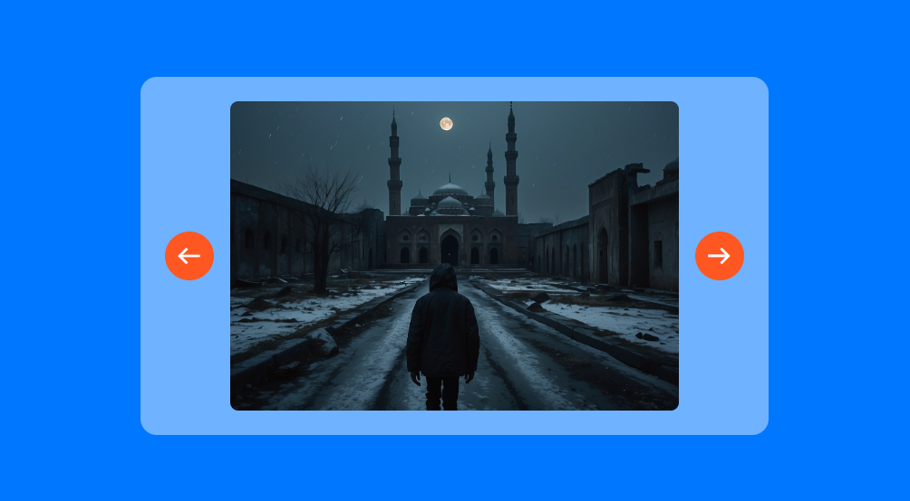

Preview 👉 https://alirafatartist.github.io/100DaysOfCode/implementions/Image%20Slider

+----------------------------------------+
| JavaScript Code |
+----------------------------------------+
|
+-----|-----------------------------+
| v |
| Variables |
| - currentIndex |
| - slides (NodeList of images) |
| - totalSlides |
| |
+----------------------------------+
|
+-----|-----------------------------+
| v |
| Functions |
| - showSlide(index) |
| - Ensure index bounds |
| - Calculate offset |
| - Apply transform to slider |
| - prevSlide() |
| - Call showSlide with index-1|
| - nextSlide() |
| - Call showSlide with index+1|
| |
+----------------------------------+
|
+-----|-----------------------------+
| v |
| Event Listeners |
| - Left Arrow Icon |
| - Click: Call prevSlide() |
| - Right Arrow Icon |
| - Click: Call nextSlide() |
| |
+----------------------------------+

